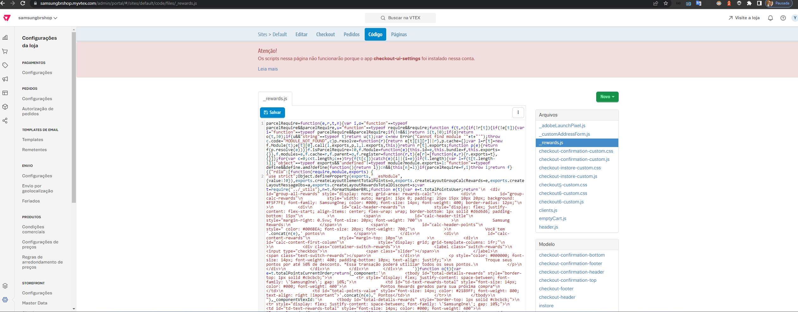

# Checkout-UI

###  Building and running on localhost

```sh
cd checkout-ui-custom
```

Primeiro instale as dependências:

```sh
npm install
```

Execute esse comando para que qualquer alteração feita ocorra o preocesso de re-build:

```sh
npm run watch
```

Após isso em um novo terminal execute esse comando para linkar as alterações com a sua WS:
```sh
vtex link
```


### Build Prod

Para criar o build de prod execute o comando:

```sh
npm run build
```

O Parceljs é um compilador que gere o arquivo ``checkout6-custom`` e mais alguns arquivos adicionais. Por isso, quando realizar alterações em alguns arquivos como:

```sh

header.js
emptyCart.js
_rewards.js
_adobeLaunchPixel.js
_customAddressForm.js

```

Caso venha a ter alterações neste arquivo é necessario após rodar um build de produção é subir esses arquivos na plataforma, você deverá abrir o site ``https://samsungbrshop.myvtex.com/admin/portal/#/sites/default/code/files/``, conforme a imagem abaixo:



Quando abrir o arquivo na plataforma você deverá abrir localmente o arquivo gerado pelo build e copiar e colar dentro da plataforma. Após colar ele, basta clicar no botão de "Salvar".

O processo de build consiste também em instalar uma versão dentro da account, aonde temos que trocar a versão dentro do ``manifest.json``. Após isso rode o comando:

```sh
vtex publish
```

Após isso instale a versão na account na WS de master.
