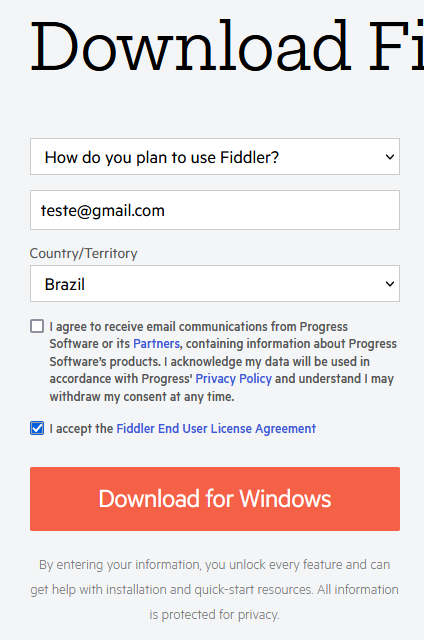

# Untitled

## Tabela de Conteúdo

## O que é

O Fiddler é um programa utilizado para gerar um proxy no sistema e interceptar requisições na rede. Na prática, isso significa que usamos o programa para redirecionar requisições dos arquivos CSS e JS da loja para as versões locais destes arquivos. Assim, você irá conseguir testar seu código numa loja CMS localmente, sem precisar subir os arquivos de fato.

Portanto, utilizamos o FIddler para testar os arquivos antes de subirmos para produção da loja.

## Como instalar

Se você seguiu o tutorial <[Por onde começar](https://www.notion.so/Por-onde-come-ar-8b20f5b680cb4160984d2ce8d9277063?pvs=21)>, você já tem o FIddler instalado na sua máquina. 

Caso já tenha, pule para o próximo tópico.

Caso não tenha, siga os seguintes passos:

1. Acesse o seguinte site: [https://www.telerik.com/download/fiddler](https://www.telerik.com/download/fiddler)
2. Nele, preencha o formulário da seguinte maneira, substituindo o e-mail pelo seu próprio:

1. O download do programa irá começar. Quando terminar, abra o arquivo .exe do Fiddler.
2. Siga os passos clicando em "I agree","Install".
3. Pronto! O FIddler foi instalado na sua máquina corretamente.

## Configuração do programa

Para configurar o Fiddler para funcionar corretamente na sua máquina, basta seguir os seguintes passos:

1. Abra o programa;
2. Se aparecer um popup, clique em "Cancelar";

1. Na parte inferior esquerda, seleciona a opção "All Processes" e depois clique em "Hide All";

1. No menu superior, certifique-se que a opção "Keep" está como 100 sessions;

1. No menu superior, clique em "Tools", depois em "Options";

1. Vá na aba "HTTPS", e clique em "Decypt HTTPS traffic";

1. Irá aparecer um popup de aviso, clique em "Yes";

1. Irá aparecer outro aviso, clique em "Sim" novamente;

1. Mais outro aviso, clique em "Sim" novamente;

1. Clique em "OK" para prosseguir;

1. Certifique-se que as opções **"...from browsers only"** e "**Ignore certificate errors"** estão ativas;

1. Clique em "Actions", depois em "Trust Root Certificate";

1. Clique em "Yes", "Sim" e "Ok" nos popups que apareceram;
2. No menu "Actions", clique em "Export Root Certificate to Desktop";

1. Clique em "OK". O arquivo de configuração do Fiddler será salvo na sua área de trabalho (o arquivo FiddlerRoot.cer na pasta C:/Users/{NOME-DO-USUARIO}/Destkop/);
2. Clique em "OK" para prosseguir.

## Configuração do navegador

Agora que configuramos o Fiddler corretamente, iremos configurar o navegador Google Chrome para suportar as interceptações do Fiddler, com os seguintes passos:

1. No menu do Google Chrome, abra a opção "Configurações"

1. Na barra de busca, digite "Certificados" e clique no menu "Segurança";

1. No final da página, clique na opção "Gerenciar certificados";

1. Na janela que apareceu, certifique-se de estar na aba "Autoridades de Certificação Raiz Confiáveis", e então clique em "Importar...".

1. Clique em "Avançar", depois, clique em "Procurar..." e vá até sua área de trabalho. Selecione o arquivo "FiddlerRoot.cer". Feito isso, clique em "Avançar" novamente;

1. Clique em "Avançar" novamente, depois, clique em "Concluir". Clique em "OK" no popup que aparecer.
2. Feche a janela dos certificados e volte para a tela do Fiddler. Iremos fazer um teste para confirmar que está tudo funcionando como esperado;
3. Selecione a aba "AutoResponder", e selecione as opções "Enable rules" e "Unmatched requests passthrough";

1. Vamos adicionar uma nova regra. Uma regra nada mais é do que uma forma de redirecionar uma requisição ou um site para outro local, seja ele um site ou um arquivo local da sua máquina.
2. Clique em "Add Rule". No campo de cima, digite [https://example.com/](https://example.com/) e no campo de baixo, digite 404_Plain.dat;

1. Agora, abra uma nova aba no Google Chrome e acessa o site https://example.com/
2. Se aparecer "Fiddler: HTTP/404 Not Found", significa que você configurou o Fiddler corretamente!

1. Pronto!

Com isso, terminamos a configuração do Fiddler e a sua configuração dentro do Chrome. Assim, já estamos aptos a desenvolver dentro da VTEX CMS.

## Dicas úteis

- Se você quiser ativar ou desativar o Fiddler enquanto ele estiver aberto, clique em "Capturing" no canto inferior esquerdo ou então aperte F12.

- Geralmente, dentro do seu repositório de VTEX CMS, terá um arquivo "client_rules.farx". Você pode usá-lo para já importar as regras correspondentes á loja que você está mexendo apenas importando o arquivo dentro do Fiddler. Na aba "AutoResponder", clique em "Import" e selecione o arquivo "client_rules.farx" do projeto correspondente.
